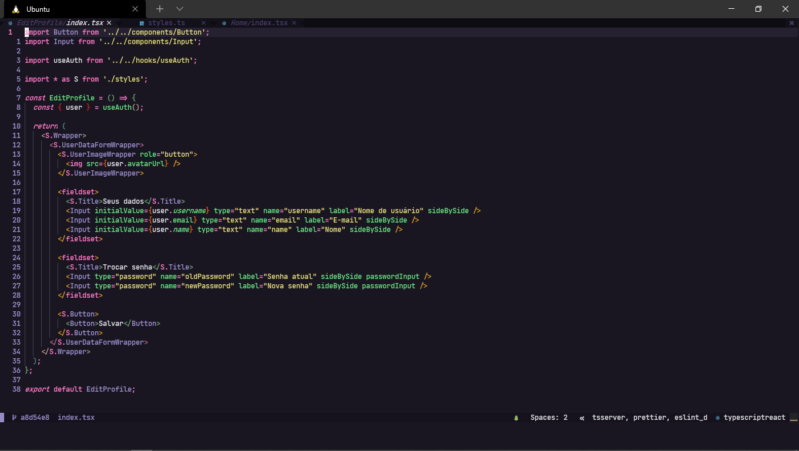

<h1 align="center">
   
  
   
  Omni for <a href="https://neovim.io/">Neovim</a>
   
</h1>

  <strong>Dark theme for <a href="https://neovim.io/">Neovim</a></strong>

  

  

  <a href="#install">Install</a> •
  <a href="#team">Team</a> •
  <a href="#license">License</a>

  

## Install

All instructions can be found at [INSTALL.md](./INSTALL.md).

## Team

This theme is maintained by the following person(s) and a bunch of [awesome contributors](https://github.com/joaom00/neovim/graphs/contributors).

|  |
| ------------------------------------------------------------------------------------------------ |
| [João Pedro](https://github.com/joaom00)                                                   |

## License

[MIT License](./LICENSE.md)
